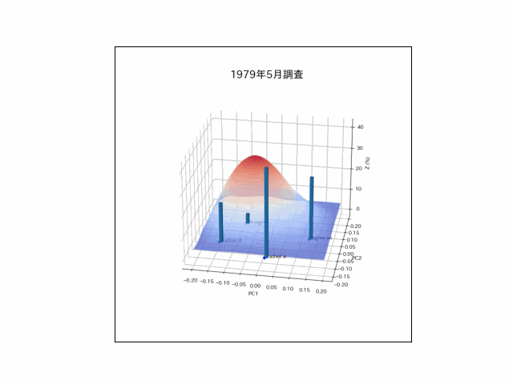

# Opinion Visualization: Mapping Perspectives in Semantic Space

This project delves into the intricate landscape of opinion divergence by leveraging sentence embeddings and principal component analysis (PCA). Through NLP techniques, it transforms abstract viewpoints into a visually striking 3D representation, revealing changes, contrasts, and underlying patterns in discourse.

## 🚀 Features
- **Advanced Sentence Embeddings**: Captures the semantic depth of opinions.
- **Dimensionality Reduction**: Applies PCA to project high-dimensional embeddings into an intuitive 3D space.
- **Immersive 3D Visualization**: Showcases the divergence and clustering of viewpoints through dynamic plots.

## 🖼 Visualization


The visualization above illustrates how opinions distribute within a 3D space. Dense clusters highlight aligned perspectives, while dispersed points signify unique or contrasting viewpoints.

## 📌 Usage
### Prerequisites
Ensure you have the following installed:
- Python 3.x
- Required libraries:
  ```bash
  pip install numpy pandas matplotlib seaborn scikit-learn sentence-transformers
  ```

### Running the Analysis
1. Prepare a dataset containing textual opinions.
2. Generate sentence embeddings using state-of-the-art transformer models (e.g., `sentence-transformers`).
3. Apply PCA to distill high-dimensional representations into three principal components.
4. Visualize the embeddings in an interactive 3D space using Matplotlib.

Example usage:
```python
from sentence_transformers import SentenceTransformer
from sklearn.decomposition import PCA
import matplotlib.pyplot as plt
import numpy as np

# Load model
model = SentenceTransformer('all-MiniLM-L6-v2')

# Sample sentences
sentences = ["Perspective A", "Perspective B", "Perspective C"]
embeddings = model.encode(sentences)

# Reduce dimensions
pca = PCA(n_components=3)
reduced_embeddings = pca.fit_transform(embeddings)

# Plot
fig = plt.figure()
ax = fig.add_subplot(111, projection='3d')
ax.scatter(reduced_embeddings[:, 0], reduced_embeddings[:, 1], reduced_embeddings[:, 2])
plt.show()
```

## 🔮 Future Enhancements
- Implement **interactive 3D visualizations** with Plotly for enhanced exploration.
- Apply **clustering algorithms** to reveal hidden opinion subgroups.
- Expand the framework to support **multilingual embeddings** for cross-cultural analysis.

---
Check out the full project on GitHub: [Opinion Visualization](https://github.com/sophiaBuss0410/opinion-visualization/tree/main).

